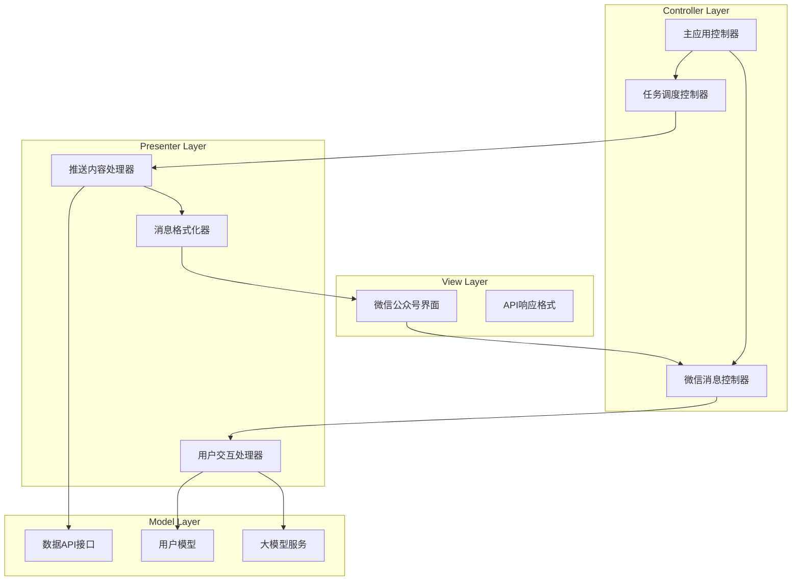
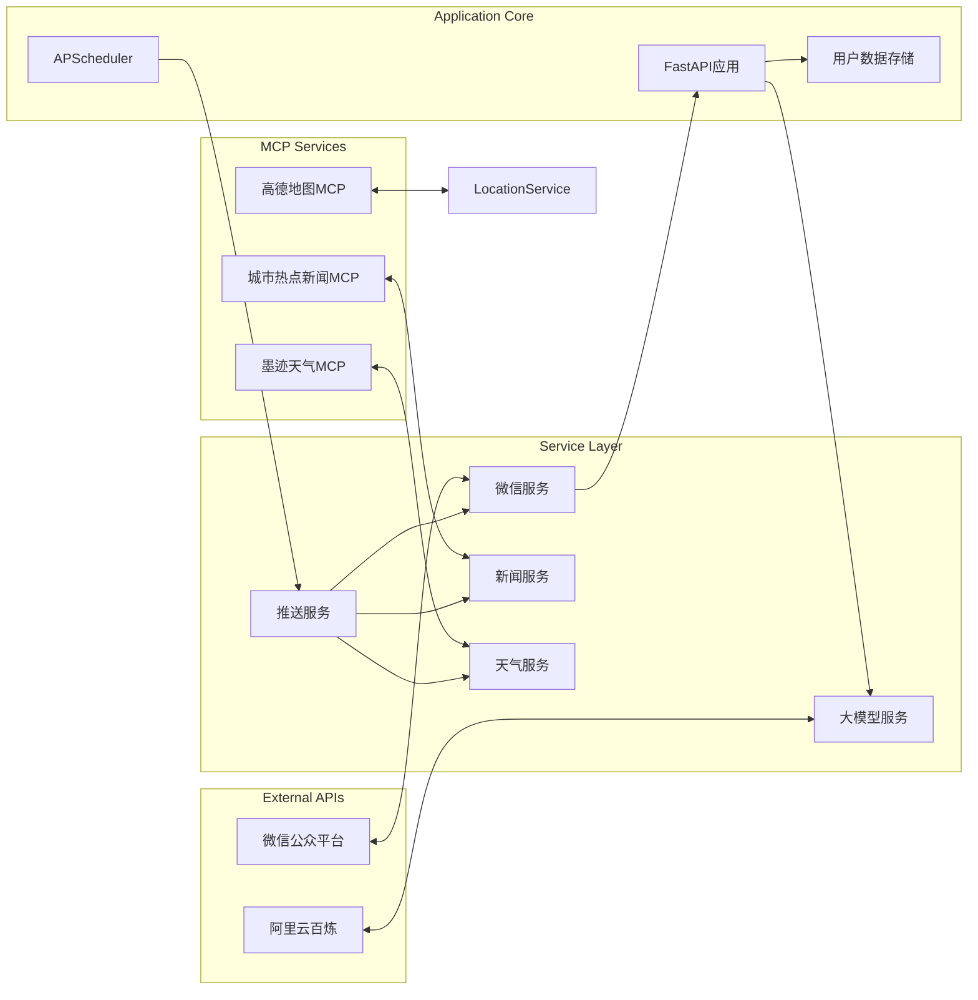
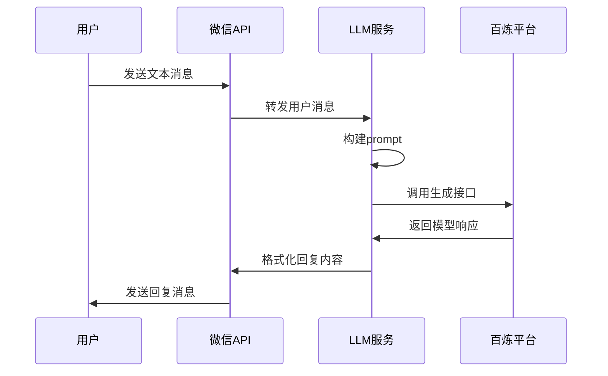
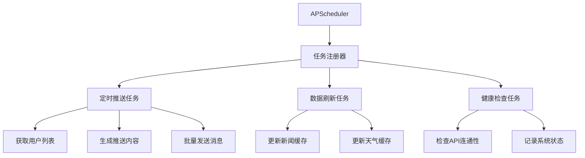
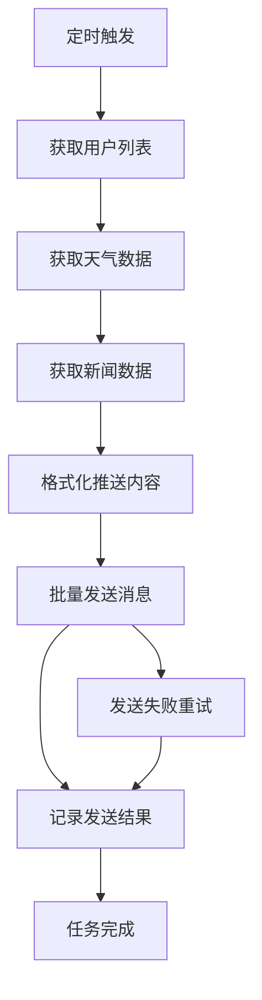
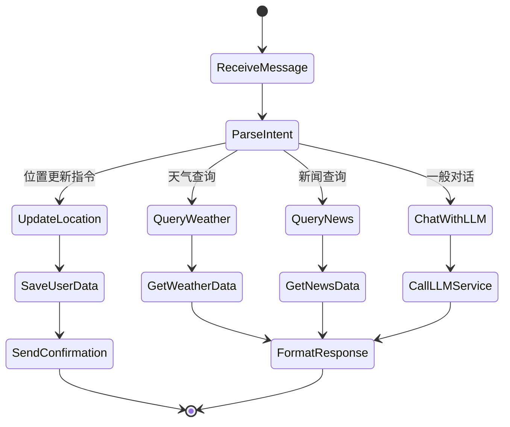
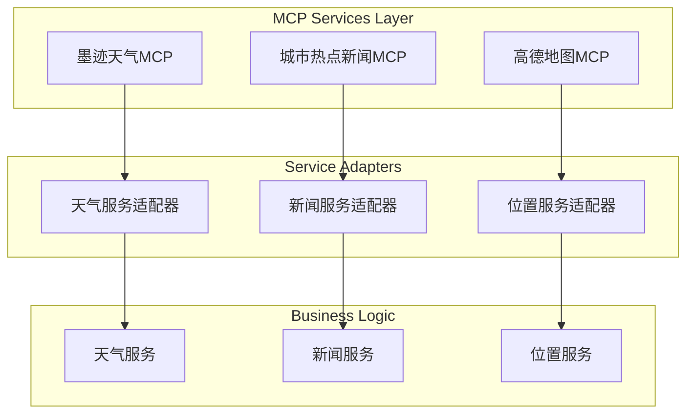
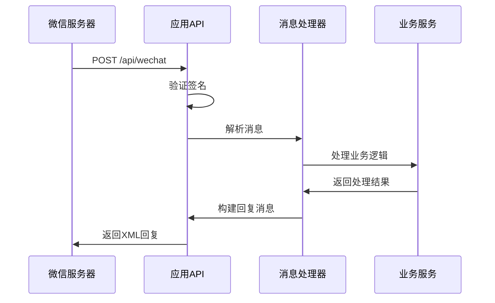
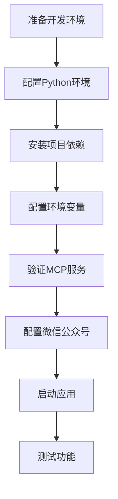

# 基于阿里云百炼平台的MCP架构新闻天气推送应用设计文档

## 1. 概述

本应用是一个基于MCP（Model-View-Controller-Presenter）架构的本地新闻、天气及国内外重要新闻实时推送系统。集成阿里云百炼大语言模型，通过微信公众号为用户提供个性化的新闻天气信息推送服务，支持用户交互和地理位置更新。

### 1.1 核心功能

- 定时新闻推送：每日定时推送天气和新闻摘要
- 智能用户交互：基于大模型的自然语言对话
- 个性化设置：用户可更新地理位置获取精准天气
- 微信集成：支持微信公众号消息收发和回复

### 1.2 技术栈

| 技术组件 | 选用方案 | 版本要求 |
|---------|---------|---------|
| Web框架 | FastAPI | >=0.68.0 |
| 大语言模型 | 阿里云百炼 DashScope | 最新版本 |
| 任务调度 | APScheduler | >=3.9.0 |
| 微信SDK | wechatpy | >=1.8.0 |
| 天气服务 | 墨迹天气 MCP 服务 | - |
| 新闻服务 | 城市热点新闻 MCP 服务 | - |
| 地图服务 | 高德地图 MCP Server | - |
| 异步运行时 | uvicorn | >=0.15.0 |

## 2. 系统架构

### 2.1 MCP架构模式



### 2.2 系统组件架构



### 2.3 目录结构设计

```
news_push_app/
├── app/
│   ├── api/                    # API路由层
│   │   └── wechat.py          # 微信API端点
│   ├── models/                 # 数据模型层
│   │   └── user.py            # 用户数据模型
│   ├── services/              # 业务逻辑层
│   │   ├── interaction.py     # 用户交互处理
│   │   ├── llm.py            # 大模型服务
│   │   ├── news.py           # 新闻数据服务
│   │   ├── push_service.py   # 推送服务
│   │   ├── scheduler.py      # 任务调度
│   │   └── weather.py        # 天气数据服务
│   └── main.py               # 应用入口
├── config/
│   └── config.py             # 配置管理
├── tests/
│   └── test_services.py      # 单元测试
├── .env                      # 环境变量
├── requirements.txt          # 依赖管理
└── README.md                # 项目说明
```

## 3. 环境配置与搭建

### 3.1 开发环境准备

#### 3.1.1 Python环境
```bash
# 推荐Python 3.8+
python --version
pip install --upgrade pip
```

#### 3.1.2 虚拟环境设置
```bash
# 创建虚拟环境
python -m venv news_push_env
# 激活虚拟环境
source news_push_env/bin/activate  # Linux/Mac
news_push_env\Scripts\activate     # Windows
```

#### 3.1.3 依赖安装
```bash
pip install -r requirements.txt
```

### 3.2 配置文件设置

#### 3.2.1 环境变量配置
创建 `.env` 文件：
```env
# 阿里云百炼
DASHSCOPE_API_KEY=your_dashscope_api_key

# 微信公众号
WECHAT_TOKEN=your_wechat_token
WECHAT_APPID=your_wechat_appid  
WECHAT_APPSECRET=your_wechat_appsecret

# MCP服务配置
# 墨迹天气MCP服务已开通，无需额外配置
# 城市热点新闻MCP服务已开通，无需额外配置  
# 高德地图MCP Server已开通，无需额外配置
```

#### 3.2.2 配置参数说明

| 参数名 | 获取方式 | 用途 |
|--------|---------|------|
| DASHSCOPE_API_KEY | 阿里云百炼控制台创建应用后获取 | 调用大语言模型 |
| WECHAT_TOKEN | 微信公众平台自定义设置 | 验证消息来源 |
| WECHAT_APPID | 微信公众平台基本配置 | 公众号唯一标识 |
| WECHAT_APPSECRET | 微信公众平台基本配置 | 公众号密钥 |

### 3.3 MCP服务说明

#### 3.3.1 已开通的MCP服务

您已开通以下三个MCP服务，无需额外配置：

1. **墨迹天气MCP服务**
   - 提供精准的天气预报数据
   - 支持全国城市天气查询
   - 包含温度、湿度、风力等详细信息
   - 支持未来7天天气预报

2. **城市热点新闻MCP服务**
   - 提供实时新闻资讯
   - 覆盖国内外重要新闻
   - 支持新闻分类和热点排序
   - 提供新闻摘要和详情

3. **高德地图MCP Server**
   - 提供地理位置服务
   - 支持城市名称标准化
   - 提供经纬度查询
   - 支持地址解析和逆解析

#### 3.3.2 阿里云百炼平台配置

1. **注册阿里云账号**
   - 访问阿里云百炼平台
   - 完成实名认证

2. **创建应用**
   ```mermaid
   flowchart TD
       A[登录百炼平台] --> B[创建新应用]
       B --> C[选择模型类型]
       C --> D[配置应用参数]
       D --> E[获取API Key]
   ```

3. **模型选择建议**
   - 推荐模型：qwen-turbo（平衡性能和成本）
   - 备选模型：qwen-plus（更高质量）

#### 3.3.2 微信公众号配置

1. **服务器配置**
   ```
   URL: http://your-domain.com/api/wechat
   Token: 与环境变量WECHAT_TOKEN一致
   EncodingAESKey: 随机生成43位字符
   消息加解密方式: 明文模式
   ```

2. **内网穿透设置**
   使用ngrok或类似工具：
   ```bash
   # 安装ngrok
   npm install -g ngrok
   
   # 启动隧道
   ngrok http 8000
   ```

## 4. 核心模块详细设计

### 4.1 大模型服务模块 (LLM Service)

#### 4.1.1 服务接口设计
```python
class LLMService:
    def __init__(self, api_key: str, model: str = "qwen-turbo")
    def generate_response(self, prompt: str, context: str = None) -> str
    def analyze_user_intent(self, message: str) -> UserIntent
    def format_news_summary(self, news_data: list) -> str
```

#### 4.1.2 调用流程


#### 4.1.3 Prompt设计策略
- **系统角色定义**：智能新闻助手
- **上下文管理**：保持会话历史
- **意图识别**：区分查询天气、新闻、位置更新等意图
- **响应格式**：结构化输出，便于后续处理

### 4.2 消息调度模块 (Scheduler)

#### 4.2.1 调度器架构


#### 4.2.2 任务配置设计
```python
scheduler_config = {
    "daily_push": {
        "trigger": "cron",
        "hour": 8,
        "minute": 0,
        "func": "push_daily_content"
    },
    "news_refresh": {
        "trigger": "interval", 
        "hours": 2,
        "func": "refresh_news_cache"
    },
    "health_check": {
        "trigger": "interval",
        "minutes": 30,
        "func": "system_health_check"
    }
}
```

#### 4.2.3 任务执行流程


### 4.3 用户交互处理模块 (Interaction)

#### 4.3.1 交互逻辑设计


#### 4.3.2 意图识别规则
```python
intent_patterns = {
    "update_location": [
        r"更改城市\s*(.+)",
        r"设置位置\s*(.+)",
        r"我在\s*(.+)"
    ],
    "query_weather": [
        r"天气",
        r"气温",
        r"温度"
    ],
    "query_news": [
        r"新闻",
        r"资讯",
        r"头条"
    ],
    "query_forecast": [
        r"明天天气",
        r"未来\d+天",
        r"天气预报"
    ]
}
```

#### 4.3.3 MCP服务集成响应策略

**基于MCP服务的响应生成**
```python
class ResponseGenerator:
    """
    响应生成器，集成MCP服务
    """
    def __init__(self):
        self.weather_service = WeatherService()  # 墨迹天气MCP
        self.news_service = NewsService()       # 城市新闻MCP
        self.location_service = LocationService() # 高德地图MCP
        self.llm_service = LLMService()         # 百炼大模型
    
    def generate_weather_response(self, city: str, detailed: bool = False) -> str:
        """
        生成天气响应
        """
        # 使用高德地图标准化城市名
        normalized_city = self.location_service.normalize_city_name(city)
        
        if detailed:
            return self.weather_service.get_detailed_forecast(normalized_city)
        else:
            return self.weather_service.get_weather_summary(normalized_city)
    
    def generate_news_response(self, category: str = None, city: str = None) -> str:
        """
        生成新闻响应
        """
        if category:
            return self.news_service.get_news_by_category(category)
        elif city:
            return self.news_service.get_city_news(city)
        else:
            return self.news_service.get_daily_news_summary()
    
    def generate_location_update_response(self, user_id: str, location: str) -> str:
        """
        处理位置更新
        """
        # 验证位置有效性
        if not self.location_service.validate_location(location):
            return f"抱歉，无法识别位置 '{location}'，请提供正确的城市名称。"
        
        # 标准化城市名
        normalized_city = self.location_service.normalize_city_name(location)
        
        # 保存用户位置（这里需要数据存储）
        # save_user_location(user_id, normalized_city)
        
        # 获取当前天气作为确认
        weather_info = self.weather_service.get_weather_summary(normalized_city)
        
        return f"位置已更新为 {normalized_city}！\n\n{weather_info}"
```

### 4.4 MCP服务集成模块

#### 4.4.1 MCP服务架构


#### 4.4.2 MCP服务接口设计

**墨迹天气MCP服务接口**
```python
class MojiWeatherMCP:
    """
    墨迹天气MCP服务适配器
    """
    def get_current_weather(self, city: str) -> dict
    def get_weather_forecast(self, city: str, days: int = 7) -> list
    def get_weather_indices(self, city: str) -> dict  # 生活指数
    def get_air_quality(self, city: str) -> dict

class WeatherService:
    """
    天气业务服务类，使用单例模式
    """
    def __init__(self):
        self.mcp_client = MojiWeatherMCP()
    
    def get_weather_summary(self, city: str) -> str
    def get_detailed_forecast(self, city: str) -> str
    def format_push_weather(self, city: str) -> str
```

**城市热点新闻MCP服务接口**
```python
class CityNewsMCP:
    """
    城市热点新闻MCP服务适配器
    """
    def get_hot_news(self, city: str = None, limit: int = 10) -> list
    def get_news_by_category(self, category: str, limit: int = 5) -> list
    def get_breaking_news(self, limit: int = 5) -> list
    def search_news(self, keyword: str, limit: int = 10) -> list

class NewsService:
    """
    新闻业务服务类，使用单例模式
    """
    def __init__(self):
        self.mcp_client = CityNewsMCP()
    
    def get_daily_news_summary(self, city: str = None) -> str
    def get_news_by_interest(self, user_id: str) -> str
    def format_push_news(self, limit: int = 5) -> str
```

**高德地图MCP服务接口**
```python
class GaodeMapMCP:
    """
    高德地图MCP服务适配器
    """
    def geocode(self, address: str) -> dict  # 地址转坐标
    def regeocode(self, lat: float, lng: float) -> dict  # 坐标转地址
    def city_search(self, keyword: str) -> list
    def get_city_info(self, city: str) -> dict
    def validate_city_name(self, city: str) -> str  # 标准化城市名

class LocationService:
    """
    位置服务类，使用单例模式
    """
    def __init__(self):
        self.mcp_client = GaodeMapMCP()
    
    def normalize_city_name(self, user_input: str) -> str
    def get_city_coordinates(self, city: str) -> tuple
    def validate_location(self, location: str) -> bool
```

#### 4.4.3 数据源配置
| 数据类型 | 主要来源 | 备用来源 | 刷新频率 |
|---------|---------|---------|---------|
| 国内新闻 | 极速数据API | 新浪新闻API | 2小时 |
| 国际新闻 | 极速数据API | 网易新闻API | 2小时 |
| 天气数据 | 极速数据API | 和风天气API | 1小时 |
| 生活指数 | 极速数据API | 中国天气网 | 6小时 |

### 4.5 微信集成模块

#### 4.5.1 消息处理流程


#### 4.5.2 消息类型处理
```python
message_handlers = {
    "text": handle_text_message,
    "image": handle_image_message,
    "voice": handle_voice_message,
    "event": handle_event_message
}

def handle_text_message(message):
    """
    处理文本消息，集成MCP服务
    """
    content = message.content
    user_id = message.source
    
    # 使用高德地图MCP验证城市名
    if is_location_update(content):
        city = extract_city_from_message(content)
        normalized_city = location_service.normalize_city_name(city)
        return process_location_update(user_id, normalized_city)
    
    return process_user_input(user_id, content)
```

#### 4.5.3 推送消息设计
```python
class PushMessage:
    def __init__(self, user_id: str, content: str)
    def format_daily_push(self, weather: dict, news: list) -> str
    def format_weather_update(self, weather: dict) -> str
    def format_news_summary(self, news: list) -> str
```

## 5. 数据模型设计

### 5.1 用户数据模型
```python
class User:
    user_id: str        # 微信用户唯一ID
    nickname: str       # 用户昵称
    city: str          # 用户所在城市
    subscribe_time: datetime  # 关注时间
    last_interaction: datetime  # 最后交互时间
    preferences: dict   # 用户偏好设置
    is_active: bool    # 是否活跃用户
```

### 5.2 消息数据模型
```python
class Message:
    message_id: str    # 消息唯一ID
    user_id: str      # 用户ID
    message_type: str # 消息类型
    content: str      # 消息内容
    timestamp: datetime # 消息时间
    processed: bool   # 是否已处理
```

### 5.3 推送记录模型
```python
class PushRecord:
    record_id: str    # 记录ID
    push_time: datetime # 推送时间
    target_users: list # 目标用户列表
    content_type: str # 内容类型
    success_count: int # 成功数量
    failed_count: int # 失败数量
```

## 6. API接口设计

### 6.1 微信回调接口
```
GET  /api/wechat     # 微信服务器验证
POST /api/wechat     # 接收微信消息
```

### 6.2 内部服务接口
```
GET  /api/health     # 健康检查
POST /api/push/test  # 测试推送
GET  /api/users      # 用户列表
POST /api/broadcast  # 广播消息
```

### 6.3 响应格式设计
```python
# 标准响应格式
{
    "code": 200,
    "message": "success", 
    "data": {},
    "timestamp": "2024-01-01T00:00:00Z"
}
```

## 7. 部署与运维

### 7.1 本地开发部署
```bash
# 启动应用
uvicorn app.main:app --host 0.0.0.0 --port 8000 --reload

# 启动内网穿透
ngrok http 8000
```

### 7.2 生产环境部署

#### 7.2.1 Docker容器化
```dockerfile
FROM python:3.9-slim

WORKDIR /app
COPY requirements.txt .
RUN pip install -r requirements.txt

COPY . .
EXPOSE 8000

CMD ["uvicorn", "app.main:app", "--host", "0.0.0.0", "--port", "8000"]
```

#### 7.2.2 服务器配置
- **反向代理**：Nginx配置SSL和负载均衡
- **进程管理**：使用systemd或supervisor
- **日志管理**：配置日志轮转和远程收集
- **监控报警**：集成Prometheus和Grafana

### 7.3 运维监控

#### 7.3.1 健康检查指标
- API响应时间
- 大模型调用成功率
- 消息推送成功率
- 系统资源使用率

#### 7.3.2 告警配置
```python
alert_rules = {
    "api_response_time": {"threshold": 5000, "unit": "ms"},
    "llm_error_rate": {"threshold": 0.05, "unit": "percent"}, 
    "push_failure_rate": {"threshold": 0.1, "unit": "percent"},
    "memory_usage": {"threshold": 0.8, "unit": "percent"}
}
```

## 8. 安全考虑

### 8.1 数据安全
- **敏感信息加密**：API密钥和用户数据加密存储
- **传输安全**：HTTPS加密传输
- **数据脱敏**：日志中隐藏敏感信息

### 8.2 访问控制
- **接口鉴权**：验证微信消息签名
- **频率限制**：防止API滥用
- **IP白名单**：限制管理接口访问

### 8.3 错误处理
- **异常捕获**：完善的异常处理机制
- **降级策略**：外部服务不可用时的备用方案
- **重试机制**：网络请求失败自动重试

## 9. 测试策略

### 9.1 单元测试
```python
# 测试大模型服务
def test_llm_service():
    service = LLMService(api_key="test_key")
    response = service.generate_response("hello")
    assert response is not None
    assert len(response) > 0
```

### 9.2 集成测试
- **微信接口测试**：模拟微信消息收发
- **调度器测试**：验证定时任务执行
- **外部API测试**：检查第三方服务集成

### 9.3 端到端测试
- **用户交互测试**：完整的消息处理流程
- **推送功能测试**：定时推送端到端验证
- **异常场景测试**：网络异常和服务降级

## 11. 完整实现流程

### 11.1 环境搭建流程



#### 11.1.1 环境准备步骤

1. **Python环境配置**
   ```bash
   # 检查Python版本（需要3.8+）
   python --version
   
   # 创建虚拟环境
   python -m venv news_push_env
   
   # 激活虚拟环境
   # Windows:
   news_push_env\Scripts\activate
   # Linux/Mac:
   source news_push_env/bin/activate
   ```

2. **项目依赖安装**
   ```bash
   # 安装依赖
   pip install -r requirements.txt
   
   # 验证关键依赖
   python -c "import fastapi; print('FastAPI installed')"
   python -c "import dashscope; print('DashScope installed')"
   python -c "import wechatpy; print('wechatpy installed')"
   ```

3. **环境变量配置**
   ```bash
   # 创建.env文件
   touch .env
   
   # 编辑.env文件，添加必要配置
   echo "DASHSCOPE_API_KEY=your_api_key" >> .env
   echo "WECHAT_TOKEN=your_token" >> .env
   echo "WECHAT_APPID=your_appid" >> .env
   echo "WECHAT_APPSECRET=your_appsecret" >> .env
   ```

### 11.2 MCP服务集成流程

#### 11.2.1 MCP服务验证

由于您已开通三个MCP服务，需要验证服务可用性：

```python
# 测试脚本：test_mcp_services.py
def test_mcp_services():
    """
    测试MCP服务连通性
    """
    try:
        # 测试墨迹天气MCP
        weather_service = WeatherService()
        weather_data = weather_service.get_weather_summary("北京")
        print(f"✅ 墨迹天气MCP服务正常: {weather_data[:50]}...")
        
        # 测试城市热点新闻MCP
        news_service = NewsService()
        news_data = news_service.get_daily_news_summary()
        print(f"✅ 城市新闻MCP服务正常: {news_data[:50]}...")
        
        # 测试高德地图MCP
        location_service = LocationService()
        city = location_service.normalize_city_name("北京市")
        print(f"✅ 高德地图MCP服务正常: {city}")
        
        return True
    except Exception as e:
        print(f"❌ MCP服务测试失败: {e}")
        return False

if __name__ == "__main__":
    test_mcp_services()
```

#### 11.2.2 服务适配器实现

**天气服务适配器**
```python
# app/services/weather.py
from typing import Dict, List
import logging

class WeatherService:
    """
    天气服务类，集成墨迹天气MCP服务
    使用单例模式提供全局访问
    """
    _instance = None
    
    def __new__(cls):
        if cls._instance is None:
            cls._instance = super().__new__(cls)
        return cls._instance
    
    def __init__(self):
        self.logger = logging.getLogger(__name__)
    
    def get_weather_summary(self, city: str) -> str:
        """
        获取天气摘要信息
        
        Args:
            city: 城市名称
            
        Returns:
            格式化的天气摘要字符串
        """
        try:
            # 调用墨迹天气MCP服务
            current_weather = self._get_current_weather_from_mcp(city)
            
            if not current_weather:
                return f"抱歉，无法获取{city}的天气信息。"
            
            return self._format_weather_summary(current_weather)
            
        except Exception as e:
            self.logger.error(f"获取天气信息失败: {e}")
            return f"天气服务暂时不可用，请稍后重试。"
    
    def get_detailed_forecast(self, city: str, days: int = 3) -> str:
        """
        获取详细天气预报
        
        Args:
            city: 城市名称
            days: 预报天数
            
        Returns:
            详细预报信息
        """
        try:
            # 调用墨迹天气MCP服务获取预报
            forecast_data = self._get_forecast_from_mcp(city, days)
            return self._format_detailed_forecast(forecast_data)
        except Exception as e:
            self.logger.error(f"获取天气预报失败: {e}")
            return "天气预报服务暂时不可用。"
    
    def _get_current_weather_from_mcp(self, city: str) -> Dict:
        """
        从墨迹天气MCP获取当前天气
        （具体实现依赖MCP服务接口）
        """
        # 这里需要根据实际MCP接口实现
        # 返回结构化天气数据
        pass
    
    def _format_weather_summary(self, weather_data: Dict) -> str:
        """
        格式化天气摘要
        """
        city = weather_data.get('city', '未知城市')
        weather = weather_data.get('weather', '未知')
        temperature = weather_data.get('temperature', 'N/A')
        humidity = weather_data.get('humidity', 'N/A')
        
        return f"{city}今日天气：{weather}，温度：{temperature}℃，湿度：{humidity}%"

# 创建全局单例实例
weather_service = WeatherService()
```

**新闻服务适配器**
```python
# app/services/news.py
from typing import List, Dict
import logging

class NewsService:
    """
    新闻服务类，集成城市热点新闻MCP服务
    使用单例模式提供全局访问
    """
    _instance = None
    
    def __new__(cls):
        if cls._instance is None:
            cls._instance = super().__new__(cls)
        return cls._instance
    
    def __init__(self):
        self.logger = logging.getLogger(__name__)
    
    def get_daily_news_summary(self, limit: int = 5) -> str:
        """
        获取每日新闻摘要
        
        Args:
            limit: 新闻条数限制
            
        Returns:
            格式化的新闻摘要
        """
        try:
            # 调用城市热点新闻MCP服务
            hot_news = self._get_hot_news_from_mcp(limit)
            return self._format_news_summary(hot_news)
        except Exception as e:
            self.logger.error(f"获取新闻摘要失败: {e}")
            return "新闻服务暂时不可用，请稍后重试。"
    
    def get_news_by_category(self, category: str, limit: int = 3) -> str:
        """
        按分类获取新闻
        
        Args:
            category: 新闻分类（如：科技、体育、财经）
            limit: 新闻条数
            
        Returns:
            分类新闻内容
        """
        try:
            news_data = self._get_category_news_from_mcp(category, limit)
            return self._format_category_news(category, news_data)
        except Exception as e:
            self.logger.error(f"获取{category}新闻失败: {e}")
            return f"无法获取{category}类新闻，请稍后重试。"
    
    def search_news(self, keyword: str, limit: int = 5) -> str:
        """
        按关键词搜索新闻
        
        Args:
            keyword: 搜索关键词
            limit: 结果数量限制
            
        Returns:
            搜索结果
        """
        try:
            search_results = self._search_news_from_mcp(keyword, limit)
            return self._format_search_results(keyword, search_results)
        except Exception as e:
            self.logger.error(f"搜索新闻失败: {e}")
            return f"无法搜索关键词'{keyword}'相关新闻。"
    
    def _format_news_summary(self, news_list: List[Dict]) -> str:
        """
        格式化新闻摘要
        """
        if not news_list:
            return "暂无新闻更新。"
        
        formatted_news = []
        for i, news in enumerate(news_list, 1):
            title = news.get('title', '无标题')
            summary = news.get('summary', '')[:50] + '...' if news.get('summary') else ''
            formatted_news.append(f"{i}. {title}\n   {summary}")
        
        return "📰 今日热点新闻：\n\n" + "\n\n".join(formatted_news)

**位置服务适配器**
```python
# app/services/location.py
from typing import Tuple, Dict
import re
import logging

class LocationService:
    """
    地理位置服务类，集成高德地图MCP Server
    使用单例模式提供全局访问
    """
    _instance = None
    
    def __new__(cls):
        if cls._instance is None:
            cls._instance = super().__new__(cls)
        return cls._instance
    
    def __init__(self):
        self.logger = logging.getLogger(__name__)
        # 常见城市别名映射
        self.city_aliases = {
            '北京市': '北京',
            '上海市': '上海',
            '广州市': '广州',
            '深圳市': '深圳',
            '成都市': '成都',
            '西安市': '西安'
        }
    
    def normalize_city_name(self, user_input: str) -> str:
        """
        标准化城市名称
        
        Args:
            user_input: 用户输入的城市名
            
        Returns:
            标准化后的城市名
        """
        try:
            # 清理输入
            city = user_input.strip()
            
            # 处理常见别名
            if city in self.city_aliases:
                city = self.city_aliases[city]
            
            # 移除常见后缀
            city = re.sub(r'[市县区镇]$', '', city)
            
            # 调用高德地图MCP验证和标准化
            validated_city = self._validate_city_with_mcp(city)
            return validated_city if validated_city else city
            
        except Exception as e:
            self.logger.error(f"城市名标准化失败: {e}")
            return user_input.strip()
    
    def validate_location(self, location: str) -> bool:
        """
        验证位置有效性
        
        Args:
            location: 位置字符串
            
        Returns:
            是否为有效位置
        """
        try:
            # 调用高德地图MCP验证
            result = self._geocode_with_mcp(location)
            return result is not None
        except Exception as e:
            self.logger.error(f"位置验证失败: {e}")
            return False
    
    def get_city_coordinates(self, city: str) -> Tuple[float, float]:
        """
        获取城市坐标
        
        Args:
            city: 城市名称
            
        Returns:
            (纬度, 经度) 元组
        """
        try:
            coords = self._get_coordinates_from_mcp(city)
            return coords if coords else (0.0, 0.0)
        except Exception as e:
            self.logger.error(f"获取城市坐标失败: {e}")
            return (0.0, 0.0)
    
    def _validate_city_with_mcp(self, city: str) -> str:
        """
        使用高德地图MCP验证城市
        （具体实现依赖MCP服务接口）
        """
        # 这里需要根据实际MCP接口实现
        pass

# 创建全局单例实例
location_service = LocationService()
```

### 11.3 微信集成流程

#### 11.3.1 微信公众号配置步骤

1. **登录微信公众平台**
   - 访问 https://mp.weixin.qq.com/
   - 使用公众号账号登录

2. **配置服务器URL**
   ```
   路径：开发 -> 基本配置 -> 服务器配置
   
   URL: https://your-domain.com/api/wechat
   Token: 与.env文件中WECHAT_TOKEN一致
   EncodingAESKey: 随机生成或使用推荐值
   消息加解密方式：明文模式
   ```

3. **启用服务器配置**
   - 点击“提交”按钮
   - 系统会验证URL的可访问性
   - 验证成功后点击“启用”

#### 11.3.2 内网穿透配置（本地开发）

```bash
# 安装ngrok
npm install -g ngrok

# 启动本地应用
uvicorn app.main:app --host 0.0.0.0 --port 8000

# 新终端启动ngrok
ngrok http 8000

# 复制显示的HTTPS URL到微信公众平台
# 例如：https://abc123.ngrok.io/api/wechat
```

### 11.4 功能测试流程

#### 11.4.1 单元测试

```python
# tests/test_mcp_integration.py
import unittest
from app.services.weather import weather_service
from app.services.news import news_service
from app.services.location import location_service

class TestMCPIntegration(unittest.TestCase):
    """
    MCP服务集成测试
    """
    
    def test_weather_service(self):
        """
        测试墨迹天气MCP服务
        """
        result = weather_service.get_weather_summary("北京")
        self.assertIsInstance(result, str)
        self.assertIn("北京", result)
    
    def test_news_service(self):
        """
        测试城市新闻MCP服务
        """
        result = news_service.get_daily_news_summary()
        self.assertIsInstance(result, str)
        self.assertIn("新闻", result)
    
    def test_location_service(self):
        """
        测试高德地图MCP服务
        """
        result = location_service.normalize_city_name("北京市")
        self.assertEqual(result, "北京")
        
        is_valid = location_service.validate_location("北京")
        self.assertTrue(is_valid)

if __name__ == '__main__':
    unittest.main()
```

#### 11.4.2 集成测试

```python
# tests/test_integration.py
import unittest
from fastapi.testclient import TestClient
from app.main import app

class TestWeChatIntegration(unittest.TestCase):
    """
    微信集成测试
    """
    
    def setUp(self):
        self.client = TestClient(app)
    
    def test_wechat_verification(self):
        """
        测试微信验证接口
        """
        response = self.client.get("/api/wechat", params={
            "signature": "test_signature",
            "timestamp": "1234567890",
            "nonce": "test_nonce",
            "echostr": "test_echo"
        })
        # 正常情况下应该返回403（签名验证失败）
        self.assertEqual(response.status_code, 403)
    
    def test_message_processing(self):
        """
        测试消息处理逻辑
        """
        # 模拟微信消息XML
        xml_data = """
        <xml>
            <ToUserName><![CDATA[toUser]]></ToUserName>
            <FromUserName><![CDATA[fromUser]]></FromUserName>
            <CreateTime>1234567890</CreateTime>
            <MsgType><![CDATA[text]]></MsgType>
            <Content><![CDATA[北京天气]]></Content>
        </xml>
        """
        
        response = self.client.post("/api/wechat", 
                                  data=xml_data, 
                                  headers={"Content-Type": "application/xml"})
        
        self.assertEqual(response.status_code, 200)
        self.assertIn("application/xml", response.headers["content-type"])

if __name__ == '__main__':
    unittest.main()
```

#### 11.4.3 端到端测试

**手动测试步骤：**

1. **关注公众号**
   - 扫码关注您的微信公众号

2. **测试基本功能**
   ```
   发送：帮助
   期望：返回可用指令列表
   
   发送：北京天气
   期望：返回北京天气信息
   
   发送：今日新闻
   期望：返回新闻摘要
   ```

3. **测试位置更新**
   ```
   发送：更改城市 上海
   期望：返回位置更新成功及上海天气
   ```

4. **测试智能对话**
   ```
   发送：今天适合穿什么衣服？
   期望：基于天气情况的智能回复
   ```

### 11.5 部署上线流程

#### 11.5.1 服务器部署

```bash
# 1. 在服务器上克隆项目
git clone <your-repo-url>
cd news_push_app

# 2. 安装依赖
pip install -r requirements.txt

# 3. 配置环境变量
cp .env.example .env
vim .env  # 填入真实配置

# 4. 配置系统服务
sudo tee /etc/systemd/system/news-push-app.service > /dev/null <<EOF
[Unit]
Description=News Push App
After=network.target

[Service]
Type=simple
User=ubuntu
WorkingDirectory=/path/to/news_push_app
ExecStart=/usr/bin/python -m uvicorn app.main:app --host 0.0.0.0 --port 8000
Restart=always

[Install]
WantedBy=multi-user.target
EOF

# 5. 启动服务
sudo systemctl daemon-reload
sudo systemctl enable news-push-app
sudo systemctl start news-push-app
```

#### 11.5.2 Nginx反向代理

```nginx
# /etc/nginx/sites-available/news-push-app
server {
    listen 80;
    server_name your-domain.com;
    
    location /api/wechat {
        proxy_pass http://127.0.0.1:8000;
        proxy_set_header Host $host;
        proxy_set_header X-Real-IP $remote_addr;
        proxy_set_header X-Forwarded-For $proxy_add_x_forwarded_for;
        proxy_set_header X-Forwarded-Proto $scheme;
    }
}
```

#### 11.5.3 SSL证书配置

```bash
# 使用Certbot申请免费SSL证书
sudo apt install certbot python3-certbot-nginx
sudo certbot --nginx -d your-domain.com

# 自动续签证书
sudo crontab -e
# 添加以下行：
## 12. 性能优化与最佳实践

### 12.1 MCP服务优化

#### 12.1.1 服务调用优化
```python
# app/services/base.py
import asyncio
from typing import Dict, Any
import logging
from functools import lru_cache

class MCPServiceBase:
    """
    MCP服务基类，提供通用优化机制
    """
    
    def __init__(self):
        self.logger = logging.getLogger(self.__class__.__name__)
        self.call_cache = {}
        self.cache_ttl = 300  # 5分钟缓存
    
    @lru_cache(maxsize=128)
    def _cache_key(self, method: str, **kwargs) -> str:
        """
        生成缓存键
        """
        import hashlib
        key_str = f"{method}:{str(sorted(kwargs.items()))}"
        return hashlib.md5(key_str.encode()).hexdigest()
    
    async def _call_with_cache(self, method: str, func, **kwargs) -> Any:
        """
        带缓存的MCP服务调用
        """
        cache_key = self._cache_key(method, **kwargs)
        
        # 检查缓存
        if cache_key in self.call_cache:
            cached_result, timestamp = self.call_cache[cache_key]
            if time.time() - timestamp < self.cache_ttl:
                self.logger.debug(f"缓存命中: {method}")
                return cached_result
        
        # 调用MCP服务
        try:
            result = await func(**kwargs)
            # 缓存结果
            self.call_cache[cache_key] = (result, time.time())
            return result
        except Exception as e:
            self.logger.error(f"MCP服务调用失败: {method}, {e}")
            # 返回缓存的老数据（如果存在）
            if cache_key in self.call_cache:
                cached_result, _ = self.call_cache[cache_key]
                return cached_result
            raise e
```

#### 12.1.2 并发调用优化
```python
# app/services/push_service.py
import asyncio
from typing import List

class OptimizedPushService:
    """
    优化的推送服务，支持并发MCP调用
    """
    
    def __init__(self):
        self.weather_service = weather_service
        self.news_service = news_service
        self.location_service = location_service
    
    async def generate_daily_content_async(self, city: str) -> str:
        """
        并发获取天气和新闻数据
        """
        try:
            # 并发调用多个MCP服务
            weather_task = asyncio.create_task(
                self._get_weather_async(city)
            )
            news_task = asyncio.create_task(
                self._get_news_async()
            )
            
            # 等待所有任务完成
            weather_content, news_content = await asyncio.gather(
                weather_task, 
                news_task, 
                return_exceptions=True
            )
            
            # 处理异常结果
            if isinstance(weather_content, Exception):
                weather_content = f"{city}天气信息暂时不可用"
            
            if isinstance(news_content, Exception):
                news_content = "新闻服务暂时不可用"
            
            return f"{weather_content}\n\n{news_content}"
            
        except Exception as e:
            logger.error(f"生成推送内容失败: {e}")
            return "服务暂时不可用，请稍后再试。"
    
    async def batch_push_to_users(self, user_list: List[str]) -> Dict[str, str]:
        """
        批量推送消息给用户
        """
        results = {}
        
        # 分批处理，避免并发过多
        batch_size = 10
        for i in range(0, len(user_list), batch_size):
            batch = user_list[i:i + batch_size]
            
            # 为每个用户创建推送任务
            tasks = [
                self._push_to_single_user(user_id) 
                for user_id in batch
            ]
            
            # 执行批量任务
            batch_results = await asyncio.gather(*tasks, return_exceptions=True)
            
            # 收集结果
            for user_id, result in zip(batch, batch_results):
                if isinstance(result, Exception):
                    results[user_id] = f"失败: {str(result)}"
                else:
                    results[user_id] = "成功"
            
            # 避免过频调用
            await asyncio.sleep(0.1)
        
        return results
```

### 12.2 缓存策略

#### 12.2.1 多级缓存设计
```python
# app/cache/cache_manager.py
import redis
import json
import time
from typing import Optional, Any

class CacheManager:
    """
    多级缓存管理器
    """
    
    def __init__(self):
        # 本地内存缓存
        self.local_cache = {}
        self.local_cache_ttl = {}
        
        # Redis缓存（可选）
        try:
            self.redis_client = redis.Redis(
                host='localhost', 
                port=6379, 
                decode_responses=True
            )
        except:
            self.redis_client = None
    
    def get(self, key: str) -> Optional[Any]:
        """
        获取缓存数据，先查本地再查Redis
        """
        # 检查本地缓存
        if key in self.local_cache:
            if time.time() < self.local_cache_ttl.get(key, 0):
                return self.local_cache[key]
            else:
                # 清理过期缓存
                del self.local_cache[key]
                del self.local_cache_ttl[key]
        
        # 检查Redis缓存
        if self.redis_client:
            try:
                cached_data = self.redis_client.get(key)
                if cached_data:
                    data = json.loads(cached_data)
                    # 同时更新本地缓存
                    self.set_local(key, data, ttl=300)
                    return data
            except Exception as e:
                print(f"Redis缓存获取失败: {e}")
        
        return None
    
    def set(self, key: str, value: Any, ttl: int = 3600):
        """
        设置缓存数据
        """
        # 设置本地缓存
        self.set_local(key, value, min(ttl, 600))  # 本地缓存最多10分钟
        
        # 设置Redis缓存
        if self.redis_client:
            try:
                self.redis_client.setex(
                    key, 
                    ttl, 
                    json.dumps(value, ensure_ascii=False)
                )
            except Exception as e:
                print(f"Redis缓存设置失败: {e}")
    
    def set_local(self, key: str, value: Any, ttl: int):
        """
        设置本地缓存
        """
        self.local_cache[key] = value
        self.local_cache_ttl[key] = time.time() + ttl

# 全局缓存实例
cache_manager = CacheManager()
```

### 12.3 错误处理与重试机制

```python
# app/utils/retry.py
import asyncio
import functools
import logging
from typing import Callable, Any

def retry_with_backoff(max_retries: int = 3, base_delay: float = 1.0):
    """
    指数退避重试装饰器
    """
    def decorator(func: Callable) -> Callable:
        @functools.wraps(func)
        async def wrapper(*args, **kwargs) -> Any:
            last_exception = None
            
            for attempt in range(max_retries + 1):
                try:
                    if asyncio.iscoroutinefunction(func):
                        return await func(*args, **kwargs)
                    else:
                        return func(*args, **kwargs)
                except Exception as e:
                    last_exception = e
                    
                    if attempt == max_retries:
                        logging.error(f"Function {func.__name__} failed after {max_retries + 1} attempts: {e}")
                        raise e
                    
                    delay = base_delay * (2 ** attempt)
                    logging.warning(f"Attempt {attempt + 1} failed, retrying in {delay}s: {e}")
                    await asyncio.sleep(delay)
            
            raise last_exception
        
        return wrapper
    return decorator

# 使用示例
class RobustMCPService:
    """
    具备健壮性的MCP服务调用
    """
    
    @retry_with_backoff(max_retries=3, base_delay=0.5)
    async def call_mcp_service_with_retry(self, service_name: str, method: str, **kwargs):
        """
        带重试机制的MCP服务调用
        """
        # 实际MCP服务调用逻辑
        pass
```

### 12.4 监控与日志

```python
# app/monitoring/metrics.py
import time
from collections import defaultdict, deque
from typing import Dict, List

class MetricsCollector:
    """
    指标收集器
    """
    
    def __init__(self):
        self.counters = defaultdict(int)
        self.timers = defaultdict(list)
        self.response_times = defaultdict(lambda: deque(maxlen=100))
    
    def increment_counter(self, name: str, value: int = 1):
        """
        增加计数器
        """
        self.counters[name] += value
    
    def record_timing(self, name: str, duration: float):
        """
        记录时间指标
        """
        self.response_times[name].append(duration)
    
    def get_metrics(self) -> Dict:
        """
        获取所有指标
        """
        metrics = {
            'counters': dict(self.counters),
            'avg_response_times': {}
        }
        
        # 计算平均响应时间
        for name, times in self.response_times.items():
            if times:
                metrics['avg_response_times'][name] = sum(times) / len(times)
        
        return metrics

# 全局指标收集器
metrics = MetricsCollector()

# 时间记录装饰器
def track_timing(metric_name: str):
    def decorator(func):
        @functools.wraps(func)
        async def wrapper(*args, **kwargs):
            start_time = time.time()
            try:
                result = await func(*args, **kwargs)
                metrics.increment_counter(f"{metric_name}_success")
                return result
            except Exception as e:
                metrics.increment_counter(f"{metric_name}_error")
                raise
            finally:
                duration = time.time() - start_time
                metrics.record_timing(metric_name, duration)
        return wrapper
    return decorator
```

### 12.5 最佳实践建议

#### 12.5.1 MCP服务使用建议

1. **调用频率控制**
   - 墨迹天气MCP：建议最多每小时调用1次
   - 城市新闻MCP：建议每30分钟更新1次
   - 高德地图MCP：实时调用，但需缓存结果

2. **错误处理策略**
   - 实现熔断器模式，避免级联故障
   - 为每个MCP服务准备备用方案
   - 记录详细的错误日志供排查

3. **数据格式化**
   - 统一MCP服务返回数据的处理格式
   - 实现数据验证和清洗机制
   - 为不同用户场景提供不同的数据粒度

#### 12.5.2 系统性能优化

1. **连接池管理**
   ```python
   # 使用aiohttp连接池
   import aiohttp
   
   class HTTPClientManager:
       def __init__(self):
           self.session = None
       
       async def get_session(self):
           if not self.session:
               connector = aiohttp.TCPConnector(
                   limit=100,  # 总连接数
                   limit_per_host=20,  # 单主机连接数
                   ttl_dns_cache=300,  # DNS缓存
                   use_dns_cache=True
               )
               self.session = aiohttp.ClientSession(connector=connector)
           return self.session
   ```

2. **内存优化**
   - 使用生成器处理大量数据
   - 定期清理过期缓存
   - 限制单个用户会话数据大小

3. **并发控制**
   - 使用asyncio.Semaphore限制并发数
   - 实现任务队列避免突发流量
   - 使用熔断器保护下游服务